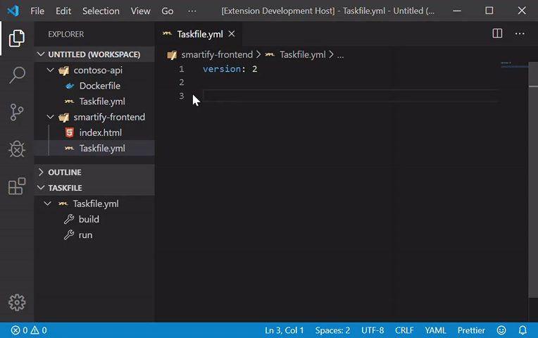
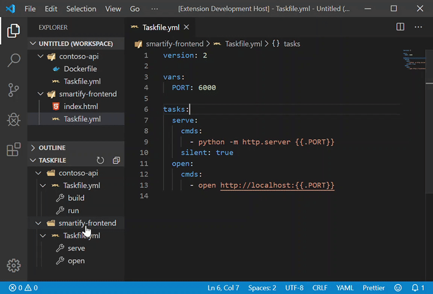
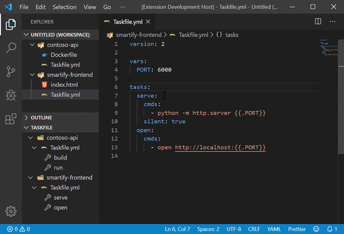
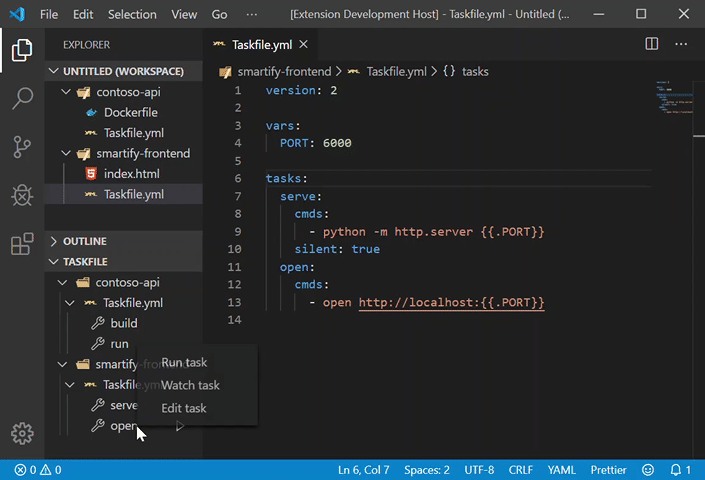

# VSCode extension for [Taskfile](https://taskfile.dev)

This extension provides Intellisense, Tasks, a Tree View and Hover actions for your Taskfiles

## Features

### Intellisense

This extensions uses ReadHat's yaml validation extension to provide intellisense of your Taskfiles.

### Tree View

Your tasks are displayed as a tree in the explorer view. This allows you to see all tasks in all workspace folders, grouped by Taskfiles. You can run, watch or edit a task from this view.

### Hover Actions

When hovering on a task in your Taskfiles, a hover menu allows you to run or watch the task.

### Task Provider

Tasks in your Taskfiles are detected and made available to VSCode's tasks system. A simple problem matcher is provided to list failed tasks in the Problems pane.

### Local installation

You can ask for the Taskfile binary to be installed locally. This will get the latest binary available and install it in the extension's storage. The extnsion will then use this binary to run your tasks.

## Roadmap

Here are listed the features intended to ship

 - Go to definition for imported tasks
 - Go to definition for variables
 - Autocomplete provider for global and task-scoped variables
